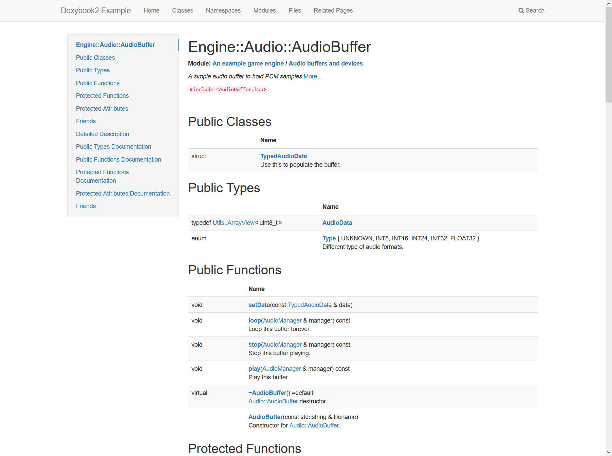

# Doxybook2

[](https://ci.appveyor.com/project/matusnovak/doxybook2/branch/master) [](https://travis-ci.com/matusnovak/doxybook2) [](https://circleci.com/gh/matusnovak/doxybook2/tree/master)

Doxygen XML to Markdown (or JSON) converter. Generate beautiful C++ documentation by converting Doxygen XML output into markdown pages via [MkDocs](https://www.mkdocs.org/), [Hugo](https://gohugo.io/), [VuePress](https://vuepress.vuejs.org/), [GitBook](https://github.com/GitbookIO/gitbook), or your custom generator. Comes with optional templating mechanism and extensive configuration file.


_[Screenshot taken from here](https://matusnovak.github.io/doxybook2/hugo-learn/classes/classengine_1_1audio_1_1audiobuffer/)_

# Table of contents

* [Description](#Description)
* [Examples](#Examples)
  * [Creating examples locally](#Creating-examples-locally)
* [Requirements](#Requirements)
* [Install](#Install)
* [Install from source](#Install-from-source)
* [Usage](#Usage)
  * [Hello World](#Hello-world)
  * [Command line arguments](#Command-line-arguments)
  * [GitBook specific usage](#GitBook-specific-usage)
  * [Generating JSON only](#Generating-JSON-only)
  * [As a library](#As-a-library)
* [Config](#Config)
  * [Generate default config](#Generate-default-config)
  * [Config usage](#Config-usage)
  * [Config examples](#Config-examples)
  * [Config values](#Config-values)
* [Templates](#Templates)
  * [Generate default templates](#Generate-default-templates)
  * [Using template](#Using-template)
  * [Debugging templates](#Debugging-templates)
* [Contributing](#Contributing)
* [Issues](#Issues)
* [License](#License)

## Description

This is a command line tool that convers Doxygen generated XML files into Markdown files (or JSON). You can use these Markdown files with [MkDocs](https://www.mkdocs.org/), [GitBook](https://github.com/GitbookIO/gitbook), [VuePress](https://vuepress.vuejs.org/), [Hugo](https://gohugo.io/), or any other markdown static site generator to create beautiful C++ documentation. I really like Doxygen, I use it all the time to create documentation for my projects, but I highly dislike the HTML output. Besides, most of the documentation for todays open source projects is done in Markdown. Why not join that together? Thus, this project was born. This project is a successor of [doxybook](https://github.com/matusnovak/doxybook) which was Python based tool that did the exact same thing. I have decided to created this next version (doxybook2!) in C++ in order to get much better memory sage, templating, and overall customization via a config file. This project is not limited just to those 4 static site generators. You can use any other one, a config file will help you to acomplish that. If you don't like the Markdown output generated by this tool, you can always make your own templates and supply them into this tool via command line. If you don't want to bother with the templates, you can generate JSON only output (which contains partial Markdown for some things), and use your own tool to create documentation you want to see.

This project is not perfect and I will never claim it will be. It does its job as best it can. There will be some weird edge cases in which the Markdown will not be properly generated. I can't catch all of those cases. Feel free to submit an issue here on GitHub to let me know if you have found something.

<details>
<summary>More screenshots</summary>
<br>

### [Hugo](https://gohugo.io/) with [Book](https://themes.gohugo.io/hugo-book/) theme ([Link](https://matusnovak.github.io/doxybook2/hugo-book/classes/classengine_1_1audio_1_1audiobuffer/))


### [MkDocs](https://www.mkdocs.org/) with [ReadTheDocs](https://mkdocs.readthedocs.io/en/stable/) theme ([Link](https://matusnovak.github.io/doxybook2/mkdocs-readthedocs/Classes/classEngine_1_1Audio_1_1AudioBuffer/))


### [MkDocs](https://www.mkdocs.org/) with [Material](https://squidfunk.github.io/mkdocs-material/) theme ([Link](https://matusnovak.github.io/doxybook2/mkdocs-material/Classes/classEngine_1_1Audio_1_1AudioBuffer/))


### [MkDocs](https://www.mkdocs.org/) with [Bootstrap](http://mkdocs.github.io/mkdocs-bootstrap/) theme ([Link](https://matusnovak.github.io/doxybook2/mkdocs-bootstrap/Classes/classEngine_1_1Audio_1_1AudioBuffer/) )



### [VuePress](https://vuepress.vuejs.org/) with default theme ([Link](https://matusnovak.github.io/doxybook2/vuepress/Classes/classEngine_1_1Audio_1_1AudioBuffer.html) )


### [GitBook](https://github.com/GitbookIO/gitbook) with default theme ([Link](https://matusnovak.github.io/doxybook2/original/classEngine_1_1Audio_1_1AudioBuffer.html))


</details>

## Examples

| Demo | Generator | Theme | Config |
| ---- | --------- | ----- | ------ |
| [Link](https://matusnovak.github.io/doxybook2/hugo-learn/classes/classengine_1_1audio_1_1audiobuffer/) | [Hugo](https://gohugo.io/) | [Learn](https://themes.gohugo.io/hugo-theme-learn/) | [.doxybook](https://github.com/matusnovak/doxybook2/tree/master/example/hugo-learn/.doxybook) |
| [Link](https://matusnovak.github.io/doxybook2/hugo-book/classes/classengine_1_1audio_1_1audiobuffer/) | [Hugo](https://gohugo.io/) | [Book](https://themes.gohugo.io/hugo-book/) | [.doxybook](https://github.com/matusnovak/doxybook2/tree/master/example/hugo-book/.doxybook) |
| [Link](https://matusnovak.github.io/doxybook2/mkdocs-readthedocs/Classes/classEngine_1_1Audio_1_1AudioBuffer/) | [MkDocs](https://www.mkdocs.org/) | [ReadTheDocs](https://mkdocs.readthedocs.io/en/stable/) | [.doxybook](https://github.com/matusnovak/doxybook2/tree/master/example/mkdocs-readthedocs/.doxybook) |
| [Link](https://matusnovak.github.io/doxybook2/mkdocs-material/Classes/classEngine_1_1Audio_1_1AudioBuffer/) | [MkDocs](https://www.mkdocs.org/) | [Material](https://squidfunk.github.io/mkdocs-material/) | [.doxybook](https://github.com/matusnovak/doxybook2/tree/master/example/mkdocs-material/.doxybook) |
| [Link](https://matusnovak.github.io/doxybook2/mkdocs-bootstrap/Classes/classEngine_1_1Audio_1_1AudioBuffer/) | [MkDocs](https://www.mkdocs.org/) | [Bootstrap](http://mkdocs.github.io/mkdocs-bootstrap/) | [.doxybook](https://github.com/matusnovak/doxybook2/tree/master/example/mkdocs-bootstrap/.doxybook) |
| [Link](https://matusnovak.github.io/doxybook2/vuepress/Classes/classEngine_1_1Audio_1_1AudioBuffer.html) | [VuePress](https://vuepress.vuejs.org/) | Default | [.doxybook](https://github.com/matusnovak/doxybook2/tree/master/example/vuepress/.doxybook) | 
| [Link](https://matusnovak.github.io/doxybook2/gitbook/Classes/classEngine_1_1Audio_1_1AudioBuffer.html) | [GitBook](https://github.com/GitbookIO/gitbook) | Default | [.doxybook](https://github.com/matusnovak/doxybook2/tree/master/example/vuepress/.doxybook) |
| [Link](https://matusnovak.github.io/doxybook2/original/classEngine_1_1Audio_1_1AudioBuffer.html) | Original Doxygen | N/A | N/A |

Source markdown files for these examples above: <https://github.com/matusnovak/doxybook2/tree/gh-pages>

### Creating examples locally

First, compile the doxybook2 and then run `examples.bat` or `examples.sh` in the root folder of this repository.

## Requirements

This tool has been compiled and tested on Windows (win32 and win64), Linux (amd64 and arm64), and OSX (amd64). Using any other architecture, such as power PC, is not guaranteed to work. You will also need Doxygen 1.8.16 or newer. Doxygen 1.8.15 is supported but I do not recommend it. Windows arm64 not tested and not supported at this moment.

## Install

Go to https://github.com/matusnovak/doxybook2/releases and download the precompiled binary in the zip file for your target platform. `doxybook2-linux-arm64` should work out of the box on Raspberry Pi, and the windows version needs [Visual C++ redistributable](https://support.microsoft.com/en-us/help/2977003/the-latest-supported-visual-c-downloads). The binary file `doxybook2.exe` is located in the `bin` folder in the zip file. Put it somewhere in your system and add it to the `PATH`. That's it. 

## Install from source

You will need [CMake](https://cmake.org/) at least version 3.0 and a C++11 compiler. The recommended setup is to use GCC 8.1.0 either amd64 or arm64 (for Linux or Raspberry Pi), XCode xcode10.2 or newer (for Mac OSX), Visual Studio 2015 or newer either Win32 or Win64 (for Windows), or MinGW-w64 8.1.0 or newer either i686 or x86_64 (for Wndows).

```bash
# Download the project and all of the submodules
git clone https://github.com/matusnovak/doxybook2.git
cd doxybook2
git submodule update --init

# Configure the project
mkdir build
cd build
cmake -G "Unix Makefiles" \
    -DDOXYBOOK_TESTS=OFF \
    -DDOXYBOOK_STATIC_STDLIB=OFF \
    -DBUILD_TESTS=OFF \
    -DBUILD_TESTING=OFF \
    -DBUILD_SHARED_LIBS=OFF \
    -DCMAKE_BUILD_TYPE=MinSizeRel \
    ..
# Build it
cmake --build .

# Done!
```

Use `-G "Visual Studio 15 2017"` when compiling for Windows/Visual Studio, or use `-G "MinGW Makefiles"` when compiling for Windows/MinGW-w64. You may need to use `cmake --build . --config MinSizeRel` when compiling with Visual Studio. The generated executable will be located in `build/src/DoxydownCli`.

## Usage

You only need Doxygen, doxybook2 from this repository, and some markdown static site generator.

### Hello World

1. Document your code so that Doxygen can pick it up.
2. Make sure your `Doxyfile` contains `GENERATE_XML = YES` and `XML_OUTPUT = xml`. A sample `Doxyfile` is provided at `example/Doxyfile` in this repository.
3. Run doxygen just by calling `doxygen` in terminal in the same directory as your `Doxyfile`.
4. Run doxybook2 as the following:


```bash
doxybook2 --input path/to/doxygen/xml --output path/to/destination
```

I highly suggest reading throuh [Config](#config) or looking into `example/xyz/.doxybook/config.json` files, and then using the config as `--config path/to/config.json`. 

### Command line arguments

```
Debug\doxybook2.exe
    -h, --help
        Shows this help message
    -i, --input
        Path to the generated Doxygen XML folder. Must contain index.xml!
    -o, --output
        Path to the target folder where to generate markdown files
    -j, --json
        Generate JSON only, no markdown, into the output path. This will also generate index.json.
    -c, --config
        Optional path to a config json file.
    --config-data
        Optional json data to override config.
    -t, --templates
        Optional path to a folder with templates.
    --generate-config
        Generate config file given a path to the destination json file
    --generate-templates
        Generate template files given a path to a target folder.
    -d, --debug-templates
        Debug templates. This will create JSON for each generated template.
    --summary-input
        Path to the summary input file. This file must contain "{{doxygen}}" string.
    --summary-output
        Where to generate summary file. This file will be created. Not a directory!

```

Note, `--config-data` can be used on top of `--config` to overwrite config properties. Example on Windows terminal (double `""` escapes the double quote):

```cmd
doxybook2 ... --config-data "{""linkSuffix:"" """"}"
```

Or Linux bash:

```bash
doxybook2 ... --config-data '{"linkSuffix": ""}`
```

### GitBook specific usage

GitBook requires that your `SUMMARY.md` file contains all of the markdown files. If the markdown file is not listed in here, it will not get generated into HTML file. So, using `--summary-input` and `--summary-output` you can generate `SUMMARY.md` file. It works by creating a "template", let's call it `SUMMARY.md.tmpl`. This template file will not get modified by doxybook2. You will need to put in any links you see fir (external links? other markdown files?). Then you will need to add `{{doxygen}}` (including the curly backets) somewhere in the summary. Note that the indentation of `{{doxygen}}` matters and will affect the output! Example:

```
# Doxybook2 Example

* [Introduction](README.md)
  {{doxygen}}
* [GitHub](https://github.com/matusnovak/doxybook2)
```

And when running:

```
doxybook2 \
    --input ... \
    --output ... \
    --config ... \
    --summary-input path/to/SUMMARY.md.tmpl \
    --summary-output path/to/SUMMARY.md
```

The `path/to/SUMMARY.md` will be generated and `{{doxygen}}` will be overwritten with a nested list. It will look like this:

```
# Doxydown Example

* [Introduction](README.md)
  * [Classes](Classes/README.md)
    * [Engine::Exception](Classes/class_engine_1_1_exception.md)
    * [Engine::Assets::Asset](Classes/class_engine_1_1_assets_1_1_asset.md)
    [...]
  * [Namespaces](Namespaces/README.md)
    * [Engine](Namespaces/namespace_engine.md)
    [...]
* [GitHub](https://github.com/matusnovak/doxydown)
```

There is a sample config and summary template file located in the `example/gitbook` folder in this repository.

### Generating JSON only

You can generate JSON only files (no Markdown) by adding `--json` to the command line (with no value). Such as this:

```
doxybook2 --input ... --output ... --json
```

### As a library

You can use this tool as a C++ library. There is a pre-compiled binary executable, static library, and header files on GitHub release page. Simply add `libdoxybook.a` into your program and provide an include path to the `include` folder. You can also include the root `CMakeLists.txt` file in this repository and compile it yourself. You will also need to link `nlohmann/json`, `tinyxml2`, and `fmtlib/fmt`. The API documentation will be added in the future, but here is a simple example to get your started:

```cpp
#include <nlohmann/json.hpp>
#include <Doxybook/Doxygen.hpp>
#include <Doxybook/Exception.hpp>
#include <Doxybook/JsonConverter.hpp>
#include <Doxybook/TextMarkdownPrinter.hpp>
#include <Doxybook/TextPlainPrinter.hpp>

int main() {
    using namespace Doxybook;

    // Where the XML files are stored
    std::string inputDir = "...";

    // Config file, override any properties you want
    Config config;
    config.copyImages = false;

    // The class that will take care of parsing XML files
    Doxygen doxygen(config);

    // There two are used to convert the XML text into markdown (or plain) text.
    // For example: <para><strong>Hello</strong></para> is converted into **Hello**
    TextPlainPrinter plainPrinter(config, doxygen);
    TextMarkdownPrinter markdownPrinter(config, inputDir, doxygen);

    // This is optional and can be used to convert the data in Node
    // into nlohmann/json
    JsonConverter jsonConverter(config, doxygen, plainPrinter, markdownPrinter);

    // Load and parse the XML files, may take few seconds
    doxygen.load(inputDir);
    doxygen.finalize(plainPrinter, markdownPrinter);

    // Get the index, this holds hierarchical data. 
    // If a class belongs to a namespace, the index will hold the namespace object,
    // but the namespace object will hold the class, not the index.
    const Node& index = doxygen.getIndex();

    // Recursive find function via refid. The refid is from the XML files.
    const Node* audioBuffer = index.find("class_engine_1_1_audio_1_1_audio_buffer");
    const Node* audioBufferConstructor = index.find("classEngine_1_1Audio_1_1AudioBuffer_1ab3f8002fc80d9bff50cfb6095e10a721");
    audioBufferConstructor->getName(); // Returns "AudioBuffer"

    // Get detailed data of this specific class
    // std::tuple<Node::Data, Node::ChildrenData>
    auto [data, childrenDataMap] = audioBuffer->loadData(config, plainPrinter, markdownPrinter, doxygen.getCache());

    // The "data" is type of Node::Data which contains
    // detailed data for this specific class.
    // The "childrenDataMap" is the same thing, but stored as an unordered map
    // where a key is a pointer to the child (the class' function for example) data.
    auto constructorData& = childrenDataMap.at(audioBufferConstructor);
}
```

## Config

All of the GitBook, MkDocs, VuePress, Hugo static site generators are slighlty different. For example, GitBook resolves markdown links at compile time, and they have to end with `.md` while MkDocs requires that the links end with a forward slash `/`. Using the config you can override this behavior. Only the properties you specify in this JSON file will be overwritten in the application.

### Generate default config

You can create a config file by running:

```
doxybook2 --generate-config /some/path/to/config.json
```

This will generate config file with **all** available properties with their **default** values. Note that the folder in which you want the `config.json` to be generated must exist. If the file `config.json` already exists, it will be overwritten. You can remove any properties in the config json and leave only the ones you need to override. 

### Config usage

Properties not specified in this `config.json` file will be loaded with the default value. You can specify only properties you want to override. Empty config file is also valid. To use the config file when generating markdown files, use it as this:

```
doxybook2 --input ... --output ... --config /some/path/to/config.json
```

### Config examples

Sample config files are provided in the examples folder for each generator and template used. The config is stored in a `.doxybook` folder. This may not be directly visible by your OS. Show hidden folders to see it. The following config files are provided:

* Hugo + Learn template - `example/hugo-learn/.doxybook/config.json`
* Hugo + Book template - `example/hugo-book/.doxybook/config.json`
* MkDocs + ReadTheDocs template - `example/mkdocs-readthedocs/.doxybook/config.json`
* MkDocs + Material theme - `example/mkdocs-material/.doxybook/config.json`
* MkDocs + Bootstrap theme - `example/mkdocs-bootstrap/.doxybook/config.json`
* VuePress + default theme - `example/vuepress/.doxybook/config.json`
* GitBook + default theme - `example/gitbook/.doxybook/config.json`

### Config values

The following is a list of config properties, their default value, and description.

| JSON Key | Default Value | Description |
| -------- | ------------- | ----------- |
| `copyImages` | `true` | Automatically copy images added into doxygen documentation via `@image`. These images will be copied into folder defined by `imagesFolder` |
| `imagesFolder` | `"images"` | Name of the folder where to copy images. This folder will be automatically created. Leave this empty string if you want all of the images to be stored in the root directory (the output directory) |
| `linkLowercase` | `false` | Convert all markdown links (only links to other markdown files, the C++ related stuff) into lowercase format. Hugo need this to set to `true`. |
| `indexInFolders` | `false` | Part of the generated markdown output are extra index files. These are more of a list of classes, namespaces, modules, etc. By default these are stored in the root directory (the output diectory). Set to true if you want them to be generated in their respective folders (i.e. class index in Classes folder, etc.) | 
| `mainPageInRoot` | `false` | If a mainpage is defined by Doxygen, then this file will be generated in `Pages/mainpage.md` path. If you want to make it into `index.md` as the root of your website, then set this to true with `mainPageName` set to `"index"`. |
| `mainPageName` | `"indexpage"` | If a mainpage is defined by Doxygen, then this file will be saved as `indexpage`. |
| `baseUrl` | `""` | A prefix to put in front of all markdown links (only links to other markdown files). See `linkLowercase` and `linkSuffix` as well. Note hat MkDocs, VuePress, and Hugo will need explicit baseUrl while GitBook uses no base url. |
| `linkSuffix` | `".md"` | The suffix to put after all of the markdown links (only links to other markdown files). If using GitBook, leave this to `".md"`, but MkDocs and Hugo needs `"/"` instead. |
| `fileExt` | `"md"` | The file extension to use when generating markdown files. |

The following are a list of config properties that specify the names of the folders. Each folder holds specific group of C++ stuff. Note that the `Classes` folder also holds interfaces, structs, and unions.

| JSON Key | Default Value |
| -------- | ------------- |
| `folderGroupsName` | `"Modules"` | 
| `folderClassesName` | `"Classes"` | 
| `folderFilesName` | `"Files"` | 
| `folderRelatedPagesName` | `"Pages"` | 
| `folderNamespacesName` | `"Namespaces"` | 

The following is a list of config properties that specify the filenames of the indexes. For example, an index/list of all classes will use `index_classes` filename followed by `fileExt` extension name.

| JSON Key | Default Value |
| -------- | ------------- |
| `indexGroupsName` | `"index_groups"` | 
| `indexClassesName` | `"index_classes"` | 
| `indexFilesName` | `"index_files"` | 
| `indexRelatedPagesName` | `"index_pages"` | 
| `indexNamespacesName` | `"index_namespaces"` | 

The following are config properties that specify what template to use for each specific C++ kind. A kind is just a type of the C++ thing (class, namespace, etc.). This also includes properties for files, directories, pages, and modules (alias groups). These templates can be overwritten via `--templates /path/to/templates-folder`.

| JSON Key | Default Value |
| -------- | ------------- |
| `templateKindClass` | `"kind_class"` | 
| `templateKindStruct` | `"kind_class"` | 
| `templateKindUnion` | `"kind_class"` | 
| `templateKindInterface` | `"kind_class"` | 
| `templateKindNamespace` | `"kind_nonclass"` | 
| `templateKindGroup` | `"kind_nonclass"` | 
| `templateKindFile` | `"kind_file"` | 
| `templateKindDir` | `"kind_file"` | 
| `templateKindPage` | `"kind_page"` |

Same as above, but these are related to the index/list files.

| JSON Key | Default Value |
| -------- | ------------- |
| `templateIndexClasses` | `"index_classes"` | 
| `templateIndexNamespaces` | `"index_namespaces"` | 
| `templateIndexGroups` | `"index_groups"` | 
| `templateIndexFiles` | `"index_files"` | 
| `templateIndexRelatedPages` | `"index_pages"` | 

These properties define the title to use in the templates specified above.

| JSON Key | Default Value |
| -------- | ------------- |
| `indexClassesTitle` | `"Classes"` | 
| `indexNamespacesTitle` | `"Namespaces"` | 
| `indexGroupsTitle` | `"Modules"` | 
| `indexFilesTitle` | `"Files"` | 
| `indexRelatedPagesTitle` | `"Pages"` | 

## Templates

This doxybook utility uses templates very similar to Jinja on Python. The template engine used is [inja](https://github.com/pantor/inja) for C++. There are already predefined templates stored inside of the doxybook executable file. If you do not specify an explicit template folder via `--templates` the default templates will be used. 

### Generate default templates

You can dump the default templates into a specific folder by calling doxybook as:

```
doxybook2 --generate-templates /path/to/folder
```

Note that the folder must exist. If there are any existing files that use the same name, they will be overwritten.

### Using template

To use the templates, simply create a folder, put some templates in there **ending with `.tmpl` file extension** and they will be automatically loaded as:

```
doxybook2 --input ... --output ... --templates /path/to/folder
```

Just as a config, if you the folder does not contain a specific template, the default one will be used. For example, Hugo + Book theme needs an extra `type: docs` in the header of the markdown. In the example folder `example/hugo-book/.doxybook` here is a template folder that gets loaded into doxybook. There exists only one single template namedd `meta.tmpl`. This template is used by `header.tmpl` template which is then further used by `kind_class`, `kind_namespace`, and so on. There are no other template files in that example directory, therefore the default ones will be used. If you remove `` from the `header.tmpl` then this `meta.tmpl` will be completely useless. So the parent-child chain is: `meta` -> `header` -> `kind_class`, where the last template is the only one requested by the program. 

Only the templates for `kind_xyz` and `index_xyz` specified in the config are required. Any additional templates in this directory will be loaded, but only used if you explicitly used them in their parent templates. You can override which template name to use for each C++ "kind" by changing the properties in the config file.

### Debugging templates

You can add `--debug-templates` into the command line (with no arguments) and a JSON files will be created alongside each markdown file. For example, if a markdown file `group___engine.md` will be created, the JSON will be created as `group___engine.md.json`.

Why is this useful and why JSON? The JSON is the container between C++ data and the [inja](https://github.com/pantor/inja) template engine. So inside the template you may find something as this: `...`. This `params` variable is extracted from the JSON. This is also the exact same JSON generated in JSON-only output. The JSON is simply put into the render function of the inja template engine. 

## Contributing

Pull requests are welcome! If you have any suggestion, feel free to submit it to repository GitHub issues.

## Issues 

Feel free to submit any bugs or issues you find to repository GitHub issues.

## License

```
Copyright (c) 2019 Matus Novak email@matusnovak.com

Permission is hereby granted, free of charge, to any person obtaining a copy
of this software and associated documentation files (the "Software"), to deal
in the Software without restriction, including without limitation the rights
to use, copy, modify, merge, publish, distribute, sublicense, and/or sell
copies of the Software, and to permit persons to whom the Software is
furnished to do so, subject to the following conditions:

The above copyright notice and this permission notice shall be included in all
copies or substantial portions of the Software.

THE SOFTWARE IS PROVIDED "AS IS", WITHOUT WARRANTY OF ANY KIND, EXPRESS OR
IMPLIED, INCLUDING BUT NOT LIMITED TO THE WARRANTIES OF MERCHANTABILITY,
FITNESS FOR A PARTICULAR PURPOSE AND NONINFRINGEMENT. IN NO EVENT SHALL THE
AUTHORS OR COPYRIGHT HOLDERS BE LIABLE FOR ANY CLAIM, DAMAGES OR OTHER
LIABILITY, WHETHER IN AN ACTION OF CONTRACT, TORT OR OTHERWISE, ARISING FROM,
OUT OF OR IN CONNECTION WITH THE SOFTWARE OR THE USE OR OTHER DEALINGS IN THE
SOFTWARE.
```
