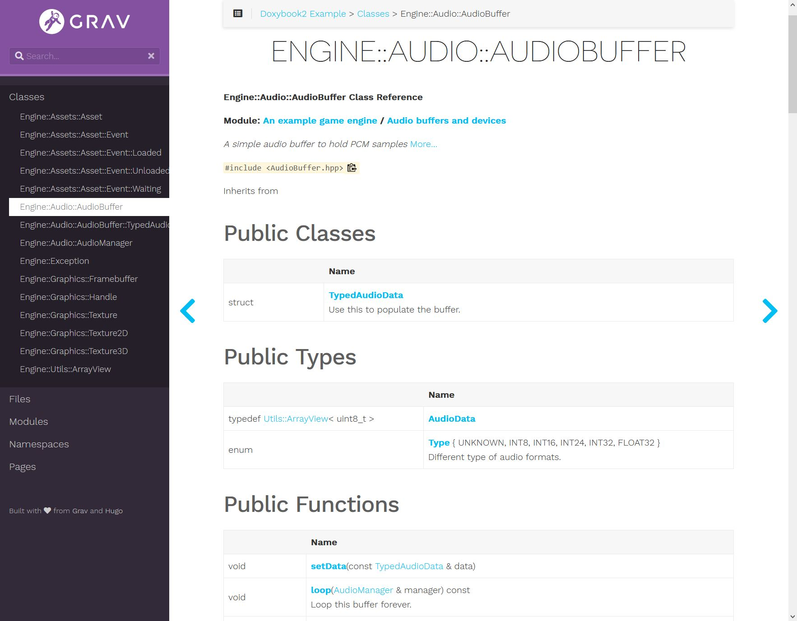
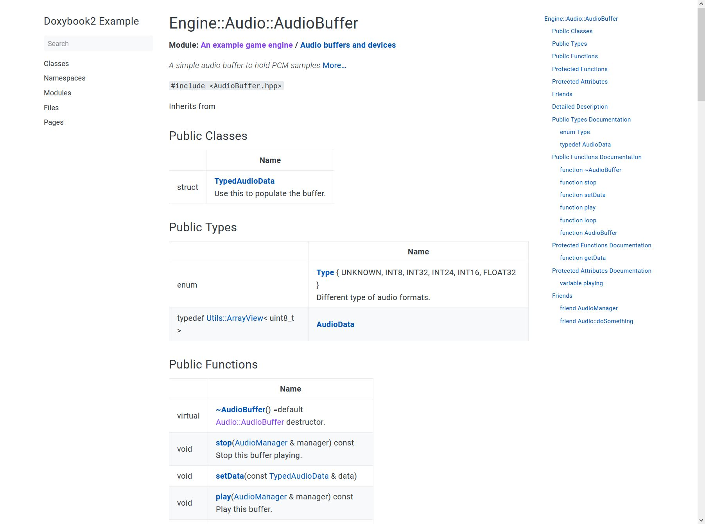
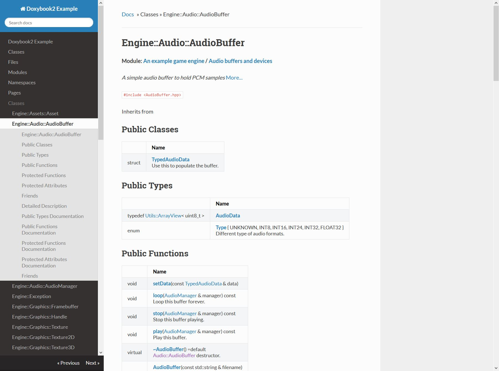
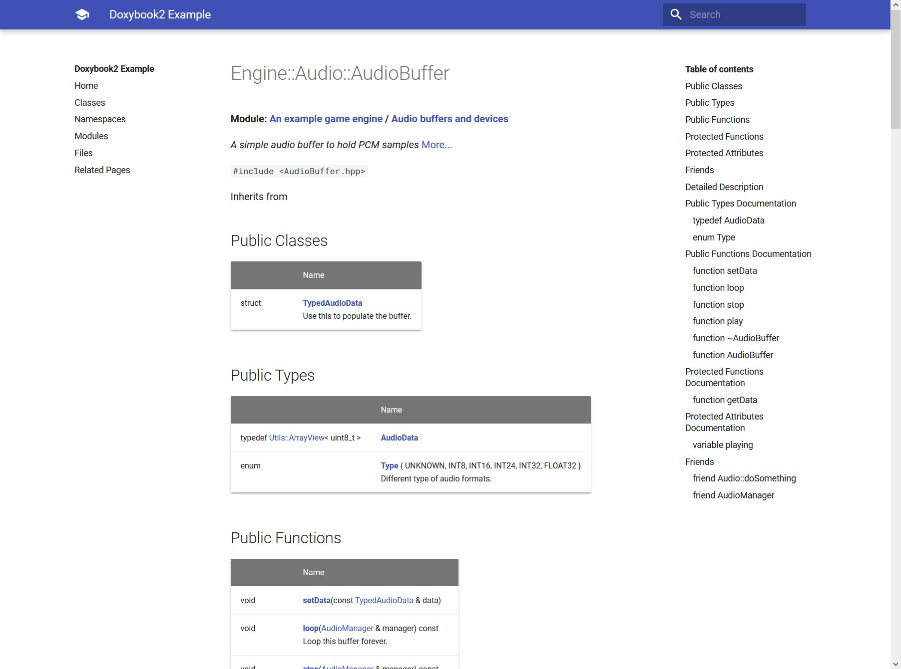
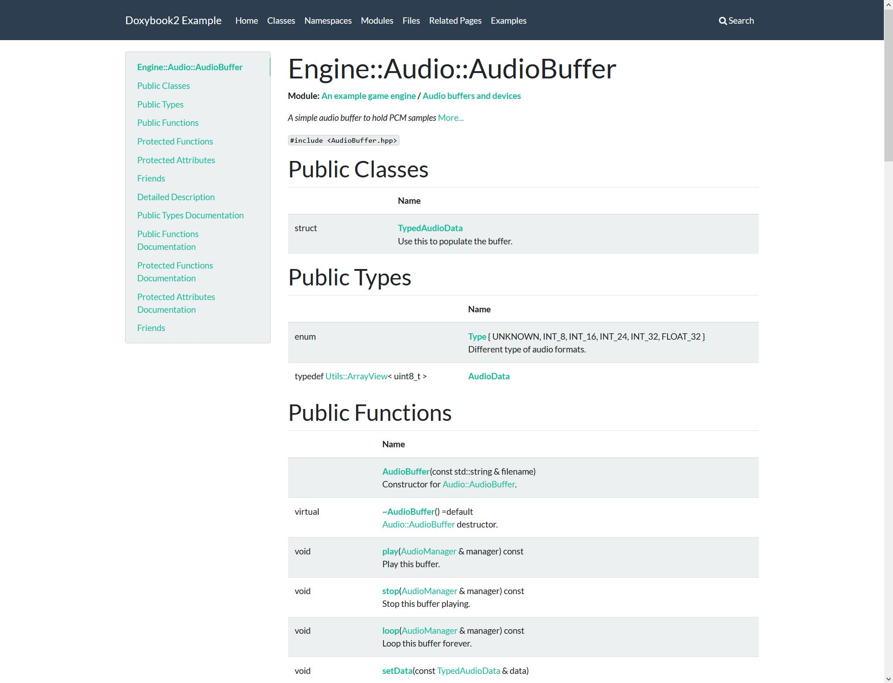
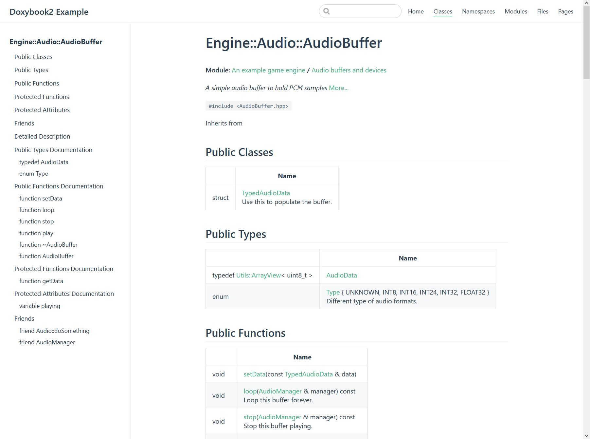
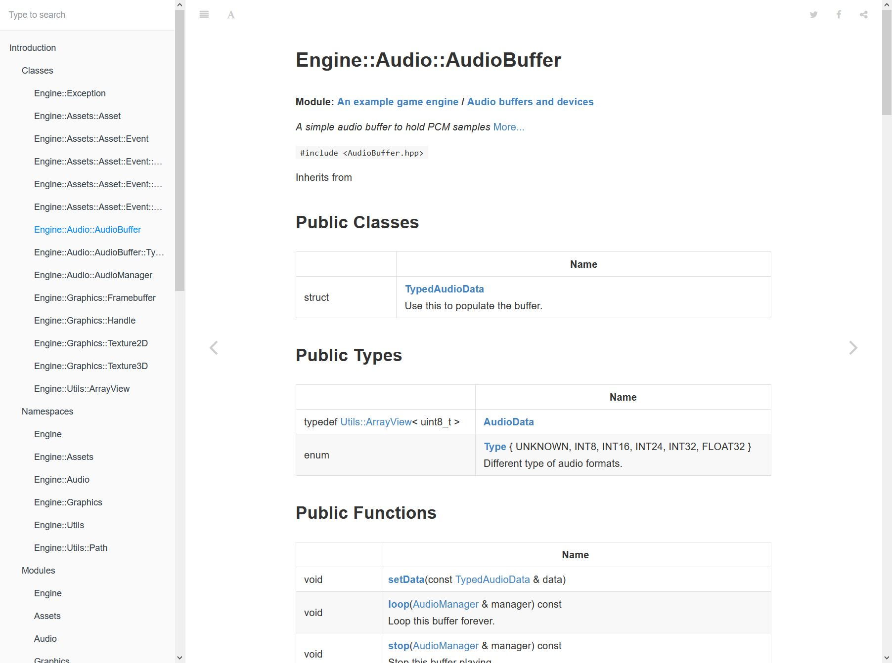
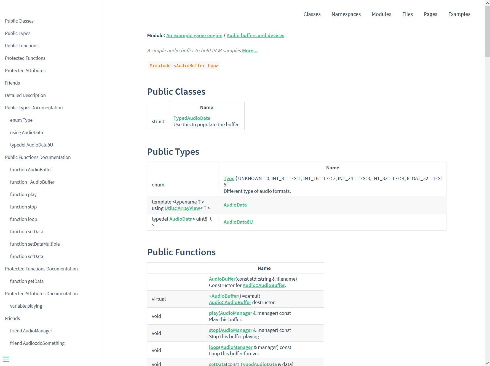

# Doxybook2

[](https://github.com/matusnovak/doxybook2/actions) [](https://github.com/matusnovak/doxybook2/releases) [](https://github.com/matusnovak/doxybook2/releases)

Doxygen XML to Markdown (or JSON) converter. Generate beautiful C++ documentation by converting Doxygen XML output into markdown pages via [MkDocs](https://www.mkdocs.org/), [Hugo](https://gohugo.io/), [VuePress](https://vuepress.vuejs.org/), [GitBook](https://github.com/GitbookIO/gitbook), [Docsify](https://docsify.js.org/#/), or your custom generator. Also comes with an optional templating mechanism and extensive configuration file.



_[Screenshot taken from here](https://matusnovak.github.io/doxybook2/hugo-learn/classes/classengine_1_1audio_1_1audiobuffer/)_

# Table of contents

* [Description](#Description)
* [Examples](#Examples)
  * [Creating examples locally](#Creating-examples-locally)
* [Requirements](#Requirements)
* [Install](#Install)
* [Install from source](#Install-from-source)
* [Usage](#Usage)
  * [Hello World](#Hello-world)
  * [Command line arguments](#Command-line-arguments)
  * [GitBook specific usage](#GitBook-specific-usage)
  * [Generating JSON only](#Generating-JSON-only)
* [Config](#Config)
  * [Generate default config](#Generate-default-config)
  * [Config usage](#Config-usage)
  * [Config examples](#Config-examples)
  * [Config values](#Config-values)
* [Templates](#Templates)
  * [Generate default templates](#Generate-default-templates)
  * [Using template](#Using-template)
  * [Debugging templates](#Debugging-templates)
* [Use as a library](#As-a-library)
* [Contributing](#Contributing)
* [Issues](#Issues)
* [Known Problems](#Known-Problems)
* [License](#License)

## Description

This is a command line tool that converts Doxygen generated XML files into markdown files (or JSON). You can use the generated Markdown files to create beautiful C++ documentation using with [MkDocs](https://www.mkdocs.org/), [GitBook](https://github.com/GitbookIO/gitbook), [VuePress](https://vuepress.vuejs.org/), [Hugo](https://gohugo.io/), [Docsify](https://docsify.js.org/#/), or any other static site generator that supports markdown. This project is a successor of [doxybook](https://github.com/matusnovak/doxybook) which was a Python based tool that did the exact same thing. I have decided to created this next version (doxybook2) in C++ in order to get better memory usage, templating, and overall better customization. This project is not limited to only the static site generators listed here, you can use any other one. The config file will help you to acomplish that by specifying the behavior or file names, relative links, etc. If you don't prefer the Markdown output generated by this tool, you can always make your own templates and supply them into this tool via the command line. If you don't want to bother with the templates, you can siply generate JSON only output (which contains partial Markdown for some things such as brief and detailed description), and use your own tool to create documentation you want.

This project is not perfect and I will never claim it will be. It does its job as best it can. There will be some weird edge cases in which the markdown will not be properly generated. I can't catch all of those cases on my own. Feel free to submit an issue here on GitHub to let me know if you have found something.

<details>
<summary>More screenshots</summary>
<br>

### [Hugo](https://gohugo.io/) with [Book](https://themes.gohugo.io/hugo-book/) theme ([Link](https://matusnovak.github.io/doxybook2/hugo-book/classes/classengine_1_1audio_1_1audiobuffer/))



### [MkDocs](https://www.mkdocs.org/) with [ReadTheDocs](https://mkdocs.readthedocs.io/en/stable/) theme ([Link](https://matusnovak.github.io/doxybook2/mkdocs-readthedocs/Classes/classEngine_1_1Audio_1_1AudioBuffer/))



### [MkDocs](https://www.mkdocs.org/) with [Material](https://squidfunk.github.io/mkdocs-material/) theme ([Link](https://matusnovak.github.io/doxybook2/mkdocs-material/Classes/classEngine_1_1Audio_1_1AudioBuffer/))



### [MkDocs](https://www.mkdocs.org/) with [Bootswatch](http://mkdocs.github.io/mkdocs-bootswatch/) theme ([Link](https://matusnovak.github.io/doxybook2/mkdocs-bootswatch/Classes/classEngine_1_1Audio_1_1AudioBuffer/) )



### [VuePress](https://vuepress.vuejs.org/) with default theme ([Link](https://matusnovak.github.io/doxybook2/vuepress/Classes/classEngine_1_1Audio_1_1AudioBuffer.html) )



### [GitBook](https://github.com/GitbookIO/gitbook) with default theme ([Link](https://matusnovak.github.io/doxybook2/original/classEngine_1_1Audio_1_1AudioBuffer.html))



### [Docsify](https://docsify.js.org/#/) with default theme (no link)


</details>

## Examples

| Demo | Generator | Theme | Config |
| ---- | --------- | ----- | ------ |
| [Link](https://matusnovak.github.io/doxybook2/hugo-learn/classes/classengine_1_1audio_1_1audiobuffer/) | [Hugo](https://gohugo.io/) | [Learn](https://themes.gohugo.io/hugo-theme-learn/) | [.doxybook](https://github.com/matusnovak/doxybook2/tree/master/example/hugo-learn/.doxybook) |
| [Link](https://matusnovak.github.io/doxybook2/hugo-book/classes/classengine_1_1audio_1_1audiobuffer/) | [Hugo](https://gohugo.io/) | [Book](https://themes.gohugo.io/hugo-book/) | [.doxybook](https://github.com/matusnovak/doxybook2/tree/master/example/hugo-book/.doxybook) |
| [Link](https://matusnovak.github.io/doxybook2/mkdocs-readthedocs/Classes/classEngine_1_1Audio_1_1AudioBuffer/) | [MkDocs](https://www.mkdocs.org/) | [ReadTheDocs](https://mkdocs.readthedocs.io/en/stable/) | [.doxybook](https://github.com/matusnovak/doxybook2/tree/master/example/mkdocs-readthedocs/.doxybook) |
| [Link](https://matusnovak.github.io/doxybook2/mkdocs-material/Classes/classEngine_1_1Audio_1_1AudioBuffer/) | [MkDocs](https://www.mkdocs.org/) | [Material](https://squidfunk.github.io/mkdocs-material/) | [.doxybook](https://github.com/matusnovak/doxybook2/tree/master/example/mkdocs-material/.doxybook) |
| [Link](https://matusnovak.github.io/doxybook2/mkdocs-bootswatch/Classes/classEngine_1_1Audio_1_1AudioBuffer/) | [MkDocs](https://www.mkdocs.org/) | [Bootswatch](http://mkdocs.github.io/mkdocs-bootswatch/) | [.doxybook](https://github.com/matusnovak/doxybook2/tree/master/example/mkdocs-bootswatch/.doxybook) |
| [Link](https://matusnovak.github.io/doxybook2/vuepress/Classes/classEngine_1_1Audio_1_1AudioBuffer.html) | [VuePress](https://vuepress.vuejs.org/) | Default | [.doxybook](https://github.com/matusnovak/doxybook2/tree/master/example/vuepress/.doxybook) | 
| [Link](https://matusnovak.github.io/doxybook2/gitbook/Classes/classEngine_1_1Audio_1_1AudioBuffer.html) | [GitBook](https://github.com/GitbookIO/gitbook) | Default | [.doxybook](https://github.com/matusnovak/doxybook2/tree/master/example/vuepress/.doxybook) |
| N/A | [Docsify](https://docsify.js.org/#/) | Default | [.doxybook](https://github.com/matusnovak/doxybook2/tree/master/example/docsify/.doxybook) |
| [Link](https://matusnovak.github.io/doxybook2/original/classEngine_1_1Audio_1_1AudioBuffer.html) | Original Doxygen | N/A | N/A |

Source markdown files for these examples above: <https://github.com/matusnovak/doxybook2/tree/gh-pages>

### Creating examples locally

First, compile the doxybook2 and then run `examples.bat` or `examples.sh` in the root folder of this repository.

## Requirements

This tool has been compiled and tested on Windows (win32 and win64), Linux (amd64 and arm64), and OSX (amd64). Using any other architecture, such as power PC, is not guaranteed to work. You will also need Doxygen 1.8.16 or newer. Doxygen 1.8.15 is supported but I do not recommend it. Windows arm64 is not tested and not supported at this moment. No extra OS dependencies needed (everything is done via git vcpkg as linked statically), simply download the executable file from the GitHub release page. If using Windows, you will need [Microsoft Visual C++ Redistributable for Visual Studio 2015, 2017 and 2019](https://support.microsoft.com/en-us/help/2977003/the-latest-supported-visual-c-downloads).

## Install

Go to https://github.com/matusnovak/doxybook2/releases and download the precompiled binary in the zip file for your target platform. The windows release needs [Microsoft Visual C++ Redistributable for Visual Studio 2015, 2017 and 2019](https://support.microsoft.com/en-us/help/2977003/the-latest-supported-visual-c-downloads). The binary file `doxybook2.exe` is located in the `bin` folder in the zip file, put it somewhere in your system and add it to the OS `PATH` environment variable.

## Install from source

To install from source, simply clone the repository, install the dependencies listed in the `vcpkg.txt` file, and use CMake + vcpkg toolchain to build it. No extra steps required.

**Requirements:**

 * [vcpkg](https://github.com/microsoft/vcpkg)
 * C++17 compiler (for example: GCC-9 or Visual Studio 2017)

```bash
# Clone the project
git clone https://github.com/matusnovak/doxybook2.git
cd doxybook2

# Install dependencies via vcpkg
# The 'vcpkg.txt' file contains the list of dependencies to install
vcpkg install --triplet x64-linux $(cat vcpkg.txt)

# Configure the project and use vcpkg toolchain
mkdir build
cmake -B ./build -G "Unix Makefiles" \
    -DCMAKE_BUILD_TYPE=MinSizeRel \
    -DCMAKE_TOOLCHAIN_FILE=/usr/local/share/vcpkg/scripts/buildsystems/vcpkg.cmake
    ..

# Build it
cmake --build ./build --config MinSizeRel

# Done!
./build/MinSizeRel/doxybook2 --help
```

## Usage

You only need Doxygen, doxybook2 from this repository, and some markdown static site generator.

### Hello World

1. Document your code so that Doxygen can pick it up.
2. Make sure your `Doxyfile` contains `GENERATE_XML = YES` and `XML_OUTPUT = xml`. A sample `Doxyfile` is provided in the `example/Doxyfile` folder in this repository.
3. Run doxygen simply by calling `doxygen` in terminal in the same directory as your `Doxyfile`.
4. Run doxybook2 as the following:


```bash
doxybook2 --input path/to/doxygen/xml --output path/to/destination
```

I highly suggest reading through the [Config](#config) or looking into `example/xyz/.doxybook/config.json` files, and then using the config as `--config path/to/config.json`. 

### Command line arguments

```
Debug\doxybook2.exe
    -h, --help
        Shows this help message
    -v, --version
        Shows the version
    -q, --quiet
        Run in quiet mode, no stdout, display only errors and warnings to stderr
    -i, --input
        Path to the generated Doxygen XML folder. Must contain index.xml!
    -o, --output
        Path to the target folder where to generate markdown files
    -j, --json
        Generate JSON only, no markdown, into the output path. This will also generate index.json.
    -c, --config
        Optional path to a config json file.
    --config-data
        Optional json data to override config.
    -t, --templates
        Optional path to a folder with templates.
    --generate-config
        Generate config file given a path to the destination json file
    --generate-templates
        Generate template files given a path to a target folder.
    -d, --debug-templates
        Debug templates. This will create JSON for each generated template.
    --summary-input
        Path to the summary input file. This file must contain "{{doxygen}}" string.
    --summary-output
        Where to generate summary file. This file will be created. Not a directory!

```

Note, `--config-data` can be used on top of `--config` to overwrite config properties. Example on Windows terminal (double `""` escapes the double quote):

```cmd
doxybook2 ... --config-data "{""linkSuffix:"" """"}"
```

Or Linux bash:

```bash
doxybook2 ... --config-data '{"linkSuffix": ""}`
```

### GitBook specific usage

GitBook requires that your `SUMMARY.md` file contains all of the other markdown files. If the markdown file is not listed in here, it will not be generated into a HTML file. Therefore, using `--summary-input` and `--summary-output` you can generate a `SUMMARY.md` file. This works by creating a "template", let's call it `SUMMARY.md.tmpl`. This template file will not get modified by doxybook2. You will need to put in any links you see fit (external links? other markdown files?), and then you will need to add `{{doxygen}}` (including the double curly backets) somewhere in this template summary. Note that the indentation of `{{doxygen}}` matters and will affect the output! Example:

```
# Doxybook2 Example

* [Introduction](README.md)
  {{doxygen}}
* [GitHub](https://github.com/matusnovak/doxybook2)
```

And when running:

```
doxybook2 \
    --input ... \
    --output ... \
    --config ... \
    --summary-input path/to/SUMMARY.md.tmpl \
    --summary-output path/to/SUMMARY.md
```

The `path/to/SUMMARY.md` will be generated and `{{doxygen}}` will be overwritten with a nested list. It will look like this:

```
# Doxybook Example

* [Introduction](README.md)
  * [Classes](Classes/README.md)
    * [Engine::Exception](Classes/class_engine_1_1_exception.md)
    * [Engine::Assets::Asset](Classes/class_engine_1_1_assets_1_1_asset.md)
    [...]
  * [Namespaces](Namespaces/README.md)
    * [Engine](Namespaces/namespace_engine.md)
    [...]
* [GitHub](https://github.com/matusnovak/doxybook)
```

There is a sample config and summary template file located in the `example/gitbook` folder in this repository.

### Generating JSON only

You can generate JSON only files (no Markdown) by adding `--json` to the command line (with no value). Such as the following:

```
doxybook2 --input ... --output ... --json
```

## Config

All of the GitBook, MkDocs, VuePress, Hugo, Docsify static site generators are slightly different. For example, GitBook resolves markdown links at compile time and they have to end with `.md`, however MkDocs requires the links to end with a forward slash `/`. Using the config you can override this behavior. Only the properties you specify in this JSON file will be overwritten in the application. The properties you do not specify in this config will use the default value instead. 

### Generate default config

You can create a config file by running:

```
doxybook2 --generate-config /some/path/to/config.json
```

This will generate config file with **all** available properties with their **default** values. Note that the folder in which you want the `config.json` to be generated must exist. If the file `config.json` already exists, it will be overwritten. You can remove any properties in the config json and leave only the ones you need to override. See the section "Config values" below to see the default values.

### Config usage

Properties not specified in this `config.json` file will be loaded with the default value. You can specify only properties you want to override. Empty config file is also valid. To use the config file when generating markdown files do the following:

```
doxybook2 --input ... --output ... --config /some/path/to/config.json
```

### Config examples

Sample config files are provided in the examples folder for each generator and theme used. The config is stored in a `.doxybook` folder. This may not be directly visible by your OS. Show hidden folders to see it. The following config files are provided:

* Hugo + Learn theme - `example/hugo-learn/.doxybook/config.json`
* Hugo + Book theme - `example/hugo-book/.doxybook/config.json`
* MkDocs + ReadTheDocs theme - `example/mkdocs-readthedocs/.doxybook/config.json`
* MkDocs + Material theme - `example/mkdocs-material/.doxybook/config.json`
* MkDocs + Bootswatch theme - `example/mkdocs-bootswatch/.doxybook/config.json`
* VuePress + default theme - `example/vuepress/.doxybook/config.json`
* GitBook + default theme - `example/gitbook/.doxybook/config.json`
* Docsify + default theme - `example/docsify/.doxybook/config.json`

**NOTE:** The configuration json files for MkDocs have a base url set, for example `"baseUrl": "/doxybook2/mkdocs-bootswatch/"`. This is needed for publishing documentation from this repository to gh-pages. If you want to run the MkDocs examples locally, make sure you change the baseUrl to `/` as `"baseUrl": "/"`! If you don't change that, you will get 404. Otherwise start a http server with a `/doxybook2/mkdocs-bootswatch` prefix.

### Config values

The following is a list of config properties, their default value, and description.

| JSON Key | Default Value | Description |
| -------- | ------------- | ----------- |
| `copyImages` | `true` | Automatically copy images added into doxygen documentation via `@image`. These images will be copied into folder defined by `imagesFolder` |
| `sort` | `false` | Sort everything alphabetically. If set to false, the order will stay the same as the order in the Doxygen XML files. |
| `imagesFolder` | `"images"` | Name of the folder where to copy images. This folder will be automatically created in the output path defined by `--output`. Leave this empty string if you want all of the images to be stored in the root directory (the output directory). |
| `linkLowercase` | `false` | Convert all markdown links (only links to other markdown files, the C++ related stuff) into lowercase format. Hugo need this to set to `true`. |
| `indexInFolders` | `false` | Part of the generated markdown output are extra index files. These are more of a list of classes, namespaces, modules, etc. By default these are stored in the root directory (the output diectory). Set to true if you want them to be generated in their respective folders (i.e. class index in Classes folder, etc.) | 
| `mainPageInRoot` | `false` | If a mainpage is defined by Doxygen, then this file will be generated in `Pages/mainpage.md` path. If you want to make it into `index.md` as the root of your website, then set this to true with `mainPageName` set to `"index"`. |
| `mainPageName` | `"indexpage"` | If a mainpage is defined by Doxygen, then this file will be saved as `indexpage`. |
| `baseUrl` | `""` | A prefix to put in front of all markdown links (only links to other markdown files). See `linkLowercase` and `linkSuffix` as well. Note hat MkDocs and Hugo will need explicit baseUrl while GitBook uses no base url. VuePress needs this set to `/`. |
| `linkSuffix` | `".md"` | The suffix to put after all of the markdown links (only links to other markdown files). If using GitBook, leave this to `".md"`, but MkDocs and Hugo needs `"/"` instead. |
| `fileExt` | `"md"` | The file extension to use when generating markdown files. |
| `filesFilter` | `[]` | This will filter which files are allowed to be in the output. For example, an array of `[".hpp", ".h"]` will allow only the files that have file extensions `.hpp` or `.h`. When this is empty (by default) then all files are allowed in the output. This also affects `--json` type of output. This does not filter which classes/functions/etc should be extracted from the source files! (For that, use Doxygen's [FILE_PATTERNS](https://www.doxygen.nl/manual/config.html#cfg_file_patterns)) This only affects listing of those files in the output! |

The following are a list of config properties that specify the names of the folders. Each folder holds specific group of C++ stuff. Note that the `Classes` folder also holds interfaces, structs, and unions.

| JSON Key | Default Value |
| -------- | ------------- |
| `folderGroupsName` | `"Modules"` | 
| `folderClassesName` | `"Classes"` | 
| `folderFilesName` | `"Files"` | 
| `folderRelatedPagesName` | `"Pages"` | 
| `folderNamespacesName` | `"Namespaces"` | 
| `folderExamplesName` | `"Examples"` | 

The following is a list of config properties that specify the filenames of the indexes. For example, an index/list of all classes will use `index_classes` filename followed by `fileExt` extension name.

| JSON Key | Default Value |
| -------- | ------------- |
| `indexGroupsName` | `"index_groups"` | 
| `indexClassesName` | `"index_classes"` | 
| `indexFilesName` | `"index_files"` | 
| `indexRelatedPagesName` | `"index_pages"` | 
| `indexNamespacesName` | `"index_namespaces"` | 
| `indexExamplesName` | `"index_examples"` | 

The following are config properties that specify what template to use for each specific C++ kind. A kind is just a type of the C++ thing (class, namespace, etc.). This also includes properties for files, directories, pages, and modules (alias groups). These templates can be overwritten via `--templates /path/to/templates-folder`.

| JSON Key | Default Value |
| -------- | ------------- |
| `templateKindClass` | `"kind_class"` | 
| `templateKindStruct` | `"kind_class"` | 
| `templateKindUnion` | `"kind_class"` | 
| `templateKindInterface` | `"kind_class"` | 
| `templateKindNamespace` | `"kind_nonclass"` | 
| `templateKindGroup` | `"kind_nonclass"` | 
| `templateKindFile` | `"kind_file"` | 
| `templateKindDir` | `"kind_file"` | 
| `templateKindPage` | `"kind_page"` |
| `templateKindExample` | `"kind_example"` |

Same as above, but these are related to the index/list files.

| JSON Key | Default Value |
| -------- | ------------- |
| `templateIndexClasses` | `"index_classes"` | 
| `templateIndexNamespaces` | `"index_namespaces"` | 
| `templateIndexGroups` | `"index_groups"` | 
| `templateIndexFiles` | `"index_files"` | 
| `templateIndexRelatedPages` | `"index_pages"` | 
| `templateIndexExamples` | `"index_examples"` | 

These properties define the title to use in the templates specified above.

| JSON Key | Default Value |
| -------- | ------------- |
| `indexClassesTitle` | `"Classes"` | 
| `indexNamespacesTitle` | `"Namespaces"` | 
| `indexGroupsTitle` | `"Modules"` | 
| `indexFilesTitle` | `"Files"` | 
| `indexRelatedPagesTitle` | `"Pages"` | 
| `indexExamplesTitle` | `"Examples"` |

## Templates

This doxybook utility uses templates very similar to Jinja on Python. The template engine used is [inja](https://github.com/pantor/inja) for C++. There are already predefined templates stored inside of the doxybook executable file. If you do not specify an explicit template folder via `--templates` the default templates will be used. 

### Generate default templates

You can dump the default templates into a specific folder by calling doxybook as:

```
doxybook2 --generate-templates /path/to/folder
```

Note that the folder must exist. If there are any existing files that use the same name, they will be overwritten.

### Using templates

To use the templates, simply create a folder, put some templates in there **ending with `.tmpl` file extension** and they will be automatically loaded as:

```
doxybook2 --input ... --output ... --templates /path/to/folder
```

Just as the config, if the folder does not contain a specific template, the default one will be used. For example, Hugo (Book theme) needs an extra `type: docs` in the header of the markdown. The folder `example/hugo-book/.doxybook/templates` contains a single template template file named `meta.tmpl`. This template is used by `header` template which is then further used by the `kind_class`, `kind_namespace`, and so on. There are no other template files in that example directory, therefore the default ones will be used.

To use custom templates, simply add them to to the directory specified by the `--templates <dir>`.

**The following are core templates that are needed to generate the output.** All of these templates are defined by the configuration file (see section "Config values" above). For example, the config key `templateKindGroup` is by default `kind_nonclass`, therefore the render engine expects `kind_nonclass.tmpl` in your templates folder (if exists).

* templateIndexExamples
* templateIndexFiles
* templateIndexGroups
* templateIndexNamespaces
* templateIndexRelatedPages
* templateKindClass
* templateKindExample
* templateKindFile
* templateKindGroup
* templateKindDir
* templateKindNamespace
* templateKindPage
* templateKindUnion
* templateKindInterface
* templateKindStruct

**The following are template names used by the core templates above.** These templates are simply dependencies of the templates above. They are being included by `` or by `{{ render(member_details, child) }}` inside of the templates above.

* meta
* header
* footer
* index
* breadcrumbs
* member_details
* mode_details
* class_members_tables
* class_members_inherited_tables
* class_members_details

### Custom templates detailed example

First, generate the default templates (this simply copies them from the executable file to the destination directory) by running `doxybook --generate-templates <dir>`. Let's say you want to override the fooder with some custom markdown. Find the `footer.tmpl` file and change the contents with whatever you want. You can delete the rest of the templates that you have not modified. Now run the executable with the `--templates <dir>` option. This will use your custom `footer.tmpl`. 

When the doxybook runs, the list of templates that are loaded is printed to the terminal right at the beginning. For example, if the template is loaded from your folder, it will print `Parsing template: 'footer' from file: '/path/to/templates/footer.tmpl`. If the template is loaded from the executable file itself (the default templates), it will print the following: `Parsing template: 'footer' from default` instead.

Now, let's say that you want to change how enums are printed (the enum table that has Enumerator, Value, and Description columns). This is located in the `member_details` template. This template is used as `{{ render("member_details", child) }}` inside of `class_members_details` and `nonclass_members_details` templates. So you only need to run `doxybook --generate-templates <dir>` and only keep `member_details.tmpl` and change it however you want.

Why `render` instead of `include`? The `include` is a keyword from the inja template engine to insert the child template file. All of the variables that are accessible in the parent template are also accessible in the child template being included. Think of it as copy pasting the contents of the child template and putting them into the parent template. The render method has a different context (global data). This means that you can pass in subset of the data accessible in the parent template. In this case, the `class_members_details` has a JSON data that also has an array `publicTypes` (if the class/struct has any public types). By default the `class_members_details` has something like this:

```

{{ render("member_details", child) }}

```

That will simply loop over the public types and renders the child by passing the array element of `publicTypes` to the render function. The render function will render the template which global context (all of the accessible data) is going to be the `child` object.

To see what does the JSON (the global data/context in the template) looks like, simply add `--debug-templates` to the command line. This will generate `*.md.json` files. Imagine that this JSON is passed into `render(..., json)` when generating, for example, `group__audio.md` (or any other markdown file except the GitBook summary file). 

### Changes to templates since 1.1.0

To include your own custom template, that does not override the default template, use `` or `{{ render("filename.tmpl", data) }}` to do so. You need to specify the file extension `.tmpl`. Your custom templates must end with `.tmpl` file extension.

Including or rendering templates by their name with no extension is only possible for the core templates specified in the config (the properties with name that starts with `template...`). This is not recommended but possible.

### Debugging templates

You can add `--debug-templates` into the command line (with no arguments) and a JSON file will be created alongside each of the markdown file. For example, if a markdown file `group___engine.md` will be created, the JSON will be created as `group___engine.md.json`.

Why is this useful and why JSON? The JSON is the container between C++ data and the [inja](https://github.com/pantor/inja) template engine. So inside the template you may find something as this: `...`. This `params` variable is extracted from the JSON. This is also the exact same JSON generated in the JSON-only output. The JSON is simply put into the render function of the inja template engine. 

## Use as a library

You can use this tool as a C++ library. There is a pre-compiled binary executable, static library, and header files on GitHub release page. Simply add `libdoxybook.a` into your program and provide an include path to the `include` folder. You can also include the root `CMakeLists.txt` file in this repository and compile it yourself. You will also need to link `nlohmann/json`, `tinyxml2`, and `fmtlib/fmt`. The API documentation will be added in the future, but here is a simple example to get your started:

```cpp
#include <nlohmann/json.hpp>
#include <Doxybook/Doxygen.hpp>
#include <Doxybook/Exception.hpp>
#include <Doxybook/JsonConverter.hpp>
#include <Doxybook/TextMarkdownPrinter.hpp>
#include <Doxybook/TextPlainPrinter.hpp>

int main() {
    using namespace Doxybook;

    // Where the XML files are stored
    std::string inputDir = "...";

    // Config file, override any properties you want
    Config config;
    config.copyImages = false;

    // The class that will take care of parsing XML files
    Doxygen doxygen(config);

    // There two are used to convert the XML text into markdown (or plain) text.
    // For example: <para><strong>Hello</strong></para> is converted into **Hello**
    TextPlainPrinter plainPrinter(config, doxygen);
    TextMarkdownPrinter markdownPrinter(config, inputDir, doxygen);

    // This is optional and can be used to convert the data in Node
    // into nlohmann/json
    JsonConverter jsonConverter(config, doxygen, plainPrinter, markdownPrinter);

    // Load and parse the XML files, may take few seconds
    doxygen.load(inputDir);
    doxygen.finalize(plainPrinter, markdownPrinter);

    // Get the index, this holds hierarchical data. 
    // If a class belongs to a namespace, the index will hold the namespace object,
    // but the namespace object will hold the class, not the index.
    const Node& index = doxygen.getIndex();

    // Recursive find function via refid. The refid is from the XML files.
    const auto audioBuffer = index.find("class_engine_1_1_audio_1_1_audio_buffer");
    const auto audioBufferConstructor = index.find("classEngine_1_1Audio_1_1AudioBuffer_1ab3f8002fc80d9bff50cfb6095e10a721");
    audioBufferConstructor->getName(); // Returns "AudioBuffer"

    // Get detailed data of this specific class
    // std::tuple<Node::Data, Node::ChildrenData>
    auto [data, childrenDataMap] = audioBuffer->loadData(config, plainPrinter, markdownPrinter, doxygen.getCache());

    // The "data" is type of Node::Data which contains
    // detailed data for this specific class.
    // The "childrenDataMap" is the same thing, but stored as an unordered map
    // where a key is a pointer to the child (the class' function for example) data.
    auto constructorData& = childrenDataMap.at(audioBufferConstructor);
}
```

## Contributing

Pull requests are welcome! Feel free to submit a pull requesr to the GitHub of this repository <https://github.com/matusnovak/doxybook2/pulls>.

## Issues 

Got any questions or found a bug? Feel free to submit them to the GitHub issues of this repository <https://github.com/matusnovak/doxybook2/issues>.

## Known Problems

#### cannot use operator[] with a string argument with number

This is a bug caused by the [inja](https://github.com/pantor/inja) dependency in version `3.0.0` and fixed in version `3.1.0`. At the time of writing this, vcpkg only has the broken version `3.0.0`. To fix this problem, use `--head` option when installing `inja` to get the bug-free latest version. See [issue #19](https://github.com/matusnovak/doxybook2/issues/19) for more information.

## License

```
The MIT License

Copyright (c) 2019-2020 Matus Novak email@matusnovak.com

Permission is hereby granted, free of charge, to any person obtaining a copy
of this software and associated documentation files (the "Software"), to deal
in the Software without restriction, including without limitation the rights
to use, copy, modify, merge, publish, distribute, sublicense, and/or sell
copies of the Software, and to permit persons to whom the Software is
furnished to do so, subject to the following conditions:

The above copyright notice and this permission notice shall be included in all
copies or substantial portions of the Software.

THE SOFTWARE IS PROVIDED "AS IS", WITHOUT WARRANTY OF ANY KIND, EXPRESS OR
IMPLIED, INCLUDING BUT NOT LIMITED TO THE WARRANTIES OF MERCHANTABILITY,
FITNESS FOR A PARTICULAR PURPOSE AND NONINFRINGEMENT. IN NO EVENT SHALL THE
AUTHORS OR COPYRIGHT HOLDERS BE LIABLE FOR ANY CLAIM, DAMAGES OR OTHER
LIABILITY, WHETHER IN AN ACTION OF CONTRACT, TORT OR OTHERWISE, ARISING FROM,
OUT OF OR IN CONNECTION WITH THE SOFTWARE OR THE USE OR OTHER DEALINGS IN THE
SOFTWARE.
```
